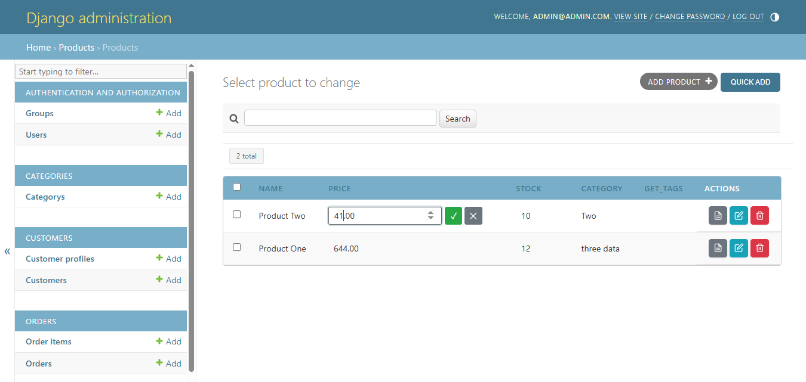
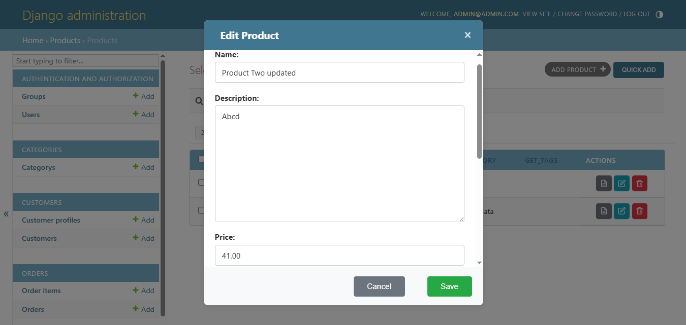
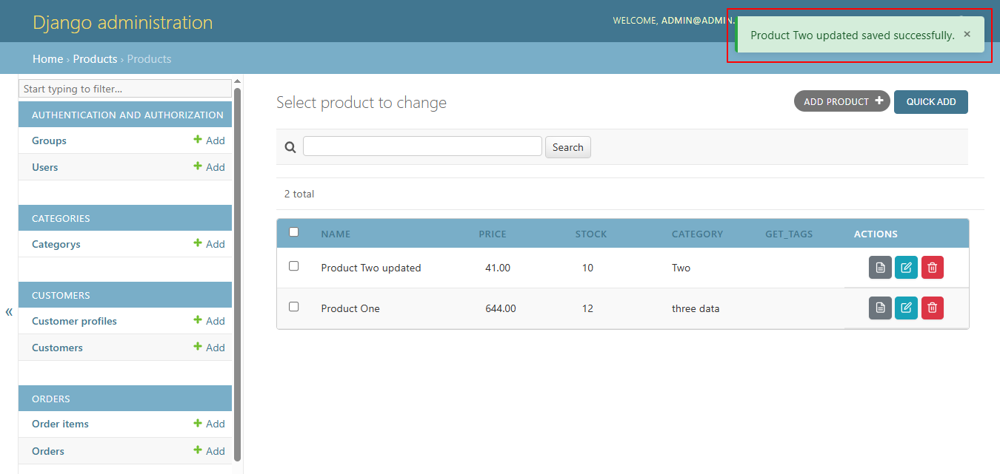
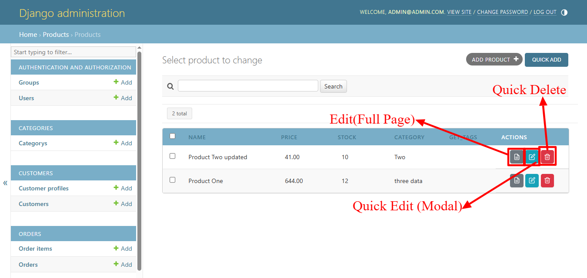

# django-htmx-admin

HTMX-Powered Django Admin Enhancement

A drop-in enhancement package that adds HTMX-powered interactions to Django Admin without requiring developers to rewrite their admin classes.

## Screenshots

### Inline Cell Editing


### Modal Forms


### Toast Notifications


### Table with HTMX Actions


## Features

- **Inline Cell Editing** — Click any cell to edit in place
- **Modal Forms** — Add/Edit records in popup modals
- **Instant Filters** — Filter results without page reload
- **Smooth Deletion** — Delete with confirmation, row fades out
- **Toast Notifications** — Success/error messages as popups
- **AJAX Pagination** — Navigate pages without reload

## Requirements

- Python 3.8+
- Django 4.0+
- django-htmx 1.14.0+

## Installation

```bash
pip install django-htmx-admin
```

Add to your `INSTALLED_APPS`:

```python
INSTALLED_APPS = [
    ...
    'django_htmx',
    'htmx_admin',
    ...
]
```

Add the middleware:

```python
MIDDLEWARE = [
    ...
    'django_htmx.middleware.HtmxMiddleware',
    'htmx_admin.middleware.HtmxMessageMiddleware',
    ...
]
```

## Usage

```python
# admin.py
from django.contrib import admin
from htmx_admin import HtmxModelAdmin
from .models import Product

@admin.register(Product)
class ProductAdmin(HtmxModelAdmin):
    list_display = ['name', 'price', 'stock', 'category']

    # New HTMX features:
    list_editable_htmx = ['price', 'stock']  # Fields that can be edited inline
    list_filter_htmx = ['category']           # Filters that update without reload
    modal_fields = ['name', 'description', 'price']  # Fields to show in modal form
```

## Configuration Options

### HtmxModelAdmin Attributes

| Attribute | Type | Description |
|-----------|------|-------------|
| `list_editable_htmx` | list[str] | Fields that can be edited inline |
| `list_filter_htmx` | list[str] | Filters that update without reload |
| `modal_fields` | list[str] | Fields to show in modal form |
| `htmx_enabled` | bool | Master toggle (default: True) |
| `toast_messages` | bool | Show toast notifications (default: True) |

## Admin Theme Support

django-htmx-admin automatically detects and adapts to your admin theme:

- **Default Django Admin** — Full support out of the box
- **Grappelli** — Automatic detection and themed templates

The package auto-detects which theme is installed and uses the appropriate templates and styling.

## How It Works

django-htmx-admin uses HTMX to enhance Django Admin with partial page updates:

1. **Inline Editing**: Clicking an editable cell sends an HTMX GET request for the edit form, then POST to save.
2. **Modal Forms**: Add/Edit buttons trigger HTMX requests that load forms into a modal overlay.
3. **Deletions**: Delete buttons send HTMX DELETE requests and animate row removal.
4. **Toast Messages**: Server responses include HX-Trigger headers that display toast notifications.

## Middleware

### HtmxMessageMiddleware

Converts Django's messages framework messages to HTMX triggers for toast notifications.

### HtmxRedirectMiddleware (optional)

Converts redirect responses to HX-Redirect headers for HTMX requests.

### HtmxVaryHeaderMiddleware (optional)

Adds `HX-Request` to the Vary header for proper caching.

## Mixins for Custom Views

You can use the provided mixins in your own views:

```python
from htmx_admin.mixins import HtmxResponseMixin, HtmxFormMixin

class MyView(HtmxResponseMixin, View):
    def post(self, request):
        # Do something
        return self.htmx_response(
            status=204,
            showMessage={'level': 'success', 'message': 'Done!'}
        )

class MyFormView(HtmxFormMixin, FormView):
    form_class = MyForm
    template_name = 'my_form.html'
```

## Template Tags

```django


{# Generate edit URL #}


{# Generate delete URL #}


{# Generate modal URL #}



{# Add toast container #}


{# Add modal container #}

```

## Contributing

Contributions are welcome! Please feel free to submit a Pull Request.

## License

MIT License - see LICENSE file for details.
